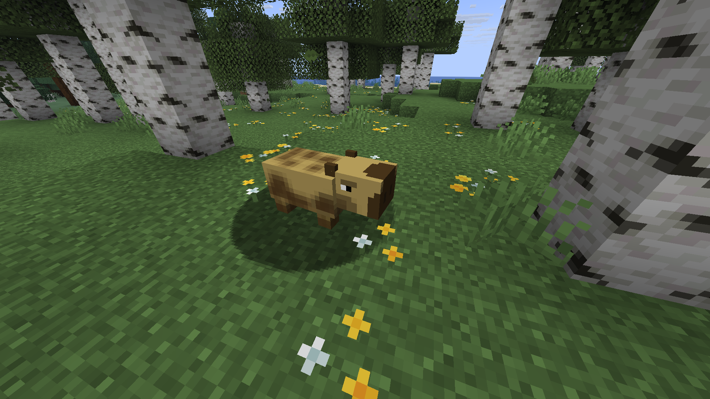

If you installed the [Bestium Example](https://github.com/huzvanec/BestiumExample) plugin, you can try running:

```
/summon bestium_example:capybara
```

(❗ the command will appear red, tab completion is not supported.)

A capybara should spawn on your server:

