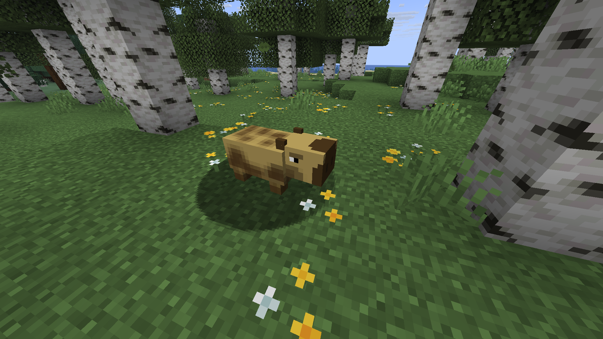

After installing the [Bestium Example](https://github.com/huzvanec/BestiumExample) plugin, you can try spawning a capybara in your world.

### Spawning a Capybara

- **Using the summon command:**

  ```
  /summon bestium_example:capybara
  ```

  Requires the `bestium.command.summon` permission or operator status.

- **Giving yourself a spawn egg:**

  ```
  /spawnegg @s bestium_example:capybara
  ```

  Requires the `bestium.command.spawnegg` permission or operator status.

- **Finding a Capybara in the wild:**  
  Capybaras spawn naturally in the [River](https://minecraft.wiki/w/River) and [Frozen River](https://minecraft.wiki/w/Frozen_River) biomes.


