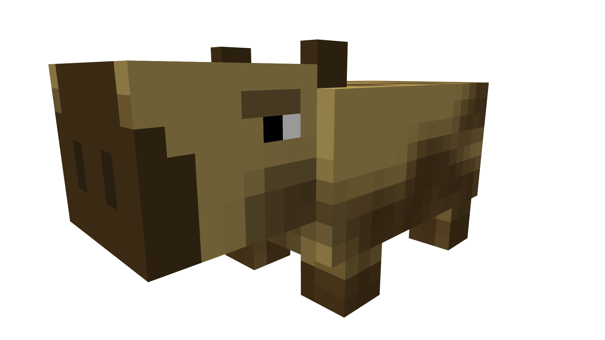

Bestium is a powerful plugin library for [PaperMC](https://papermc.io/) that lets you create **custom entities with unique behavior** without extending vanilla Minecraft classes.
What makes Bestium unique is that instead of working around Mojang's internal restrictions, Bestium injects your entity logic directly into the runtime.

 

Very much a capybara in vanilla Minecraft ☝️